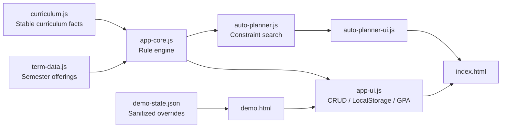

# Architecture

NCKU Credit Map is a static, local-first decision-support application. The browser owns the personal state; the repository only ships sanitized curriculum and demo data.

## Design choices

### 1. Stable IDs vs official course codes
`courseCode` is the application's stable internal identifier. `officialCourseCode` is separate so an upstream catalog change does not break local state, dependencies, or migrations.

### 2. Rule engine separated from UI
Graduation recognition, prerequisite eligibility, conflicts, GPA mapping, imports and validation live in pure functions. UI code renders results and persists state but does not redefine academic rules.

### 3. Constraint-based planner
The automatic planner searches current-term combinations and rejects any plan that violates configured credit limits, prerequisite eligibility, timetable conflicts, average-risk limits or high-risk-course limits. Valid plans are ranked by necessity, user priority, downstream unlock value and distance from target credits.

### 4. Local-first privacy
Grades, completed-course states and personal recognition decisions remain in browser LocalStorage. JSON/CSV exports are explicitly ignored by `.gitignore` when stored in the recommended private folders.

### 5. Semester uncertainty is explicit
Stable curriculum facts are kept separate from term offerings. Future-term offering data may be marked `estimated` and should be checked against the official course query before registration.

## Verification boundary

`npm run verify` performs syntax checks and regression tests covering graduation rules, migration, prerequisites, conflicts, CRUD, CSV safety, GPA projection and automatic planning constraints.
